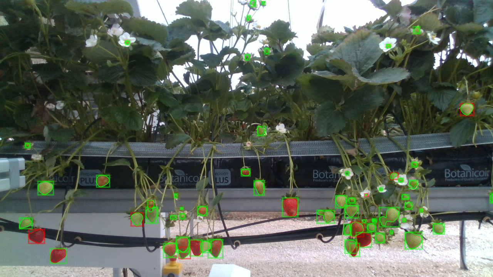

# Fruit Detector for Detectron2 MaskRCNN

Instance segmentation of a scene and outputs Mask-RCNN predictions as images and/or json message/file (Agri-OpenCore)



## Requirements
`python3` `torchvision` `pickle` `numpy` `opencv-python` `scikit-image` `matplotlib`
`detectron2`

## Installation

```
https://github.com/usmanzahidi/FruitDetector.git
pip install -r requirements. txt
git clone https://github.com/facebookresearch/detectron2.git
python -m pip install -e detectron2
```

## Usage

```bash
usage: main.py [-O]
-O  for optimized model (alphabet O)
without -O the script is executed in Debug mode and outputs json files in './annotations/predicted' and prediction images in '.output/predicted_images' folders

The configuration settings are read from config.yaml

```

## Example:

```bash
python -O main.py
OR
python main.py
```
